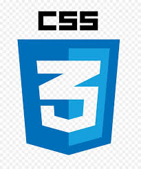

Hi 👋
I'm Halyna Bondar

📝 Currently learning React

📫 How to reach me galya.marusyak@gmail.com

📄 Know about my experiences [LinkedIn](https://www.linkedin.com/in/halyna-bondar-a5854b261/)

[Codewars ](https://www.codewars.com/users/HalynaBondar)

[Leetcode sana-shabeel](https://leetcode.com/u/halynabondar/)

Languages and Tools:

